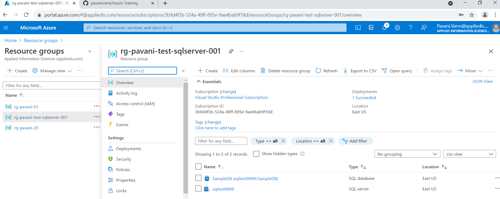
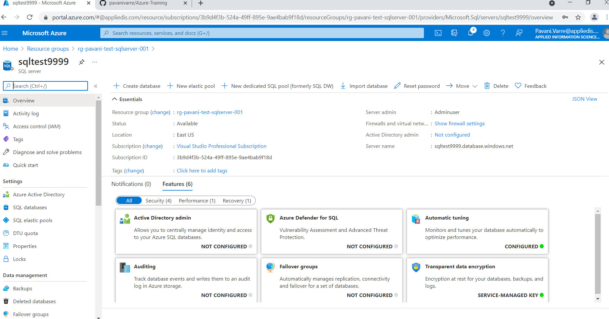

# Deploy SQL Server & Database using ARM Template and Azure CLI.

## Introduction
In this module, we are trying to deploy sql server and database in Azure using Azure Resouce Manager Template aka ARM Template and Azure CLI. 

An ARM template is a JSON(JavaScript Object Notation) file that defines the infrastructure and configuration for our project. The template uses declarative syntax which describes the intended deployment without writing commnds for the deployment.
 
## UI Look and Feel




 
## Review the template file
For the deployment of a database in Azure CLI, deploying a server is must which manages the database. The server places the database within the Azure resource group in a specified region.

For deploying the database we have following JSON files:
1. azuredeploy.json
2. azuredeploy.parameters.json


> **azuredeploy.json** 
This file contains the ARM template which contains paramters i.e. "ServerName","sqlDBName", "location", "administratorLogin", "administratorLoginPassword" and their default values. Apart from these, this file also contains resources array wherein there is a database resource within a server resource.   
```json
{
    "$schema": "https://schema.management.azure.com/schemas/2019-04-01/deploymentTemplate.json#",
    "contentVersion": "1.0.0.0",
    "parameters": {
      "serverName": {
        "type": "string",
        "defaultValue": "[uniqueString('sql', resourceGroup().id)]",
        "metadata": {
          "description": "The name of the SQL logical server."
        }
      },
      "sqlDBName": {
        "type": "string",
        "defaultValue": "SampleDB",
        "metadata": {
          "description": "The name of the SQL Database."
        }
      },
      "location": {
        "type": "string",
        "defaultValue": "[resourceGroup().location]",
        "metadata": {
          "description": "Location for all resources."
        }
      },
      "administratorLogin": {
        "type": "string",
        "metadata": {
          "description": "The administrator username of the SQL logical server."
        }
      },
      "administratorLoginPassword": {
        "type": "securestring",
        "metadata": {
          "description": "The administrator password of the SQL logical server."
        }
      }
    },
    "variables": {},
    "resources": [
      {
        "type": "Microsoft.Sql/servers",
        "apiVersion": "2020-02-02-preview",
        "name": "[parameters('serverName')]",
        "location": "[parameters('location')]",
        "properties": {
          "administratorLogin": "[parameters('administratorLogin')]",
          "administratorLoginPassword": "[parameters('administratorLoginPassword')]"
        },
        "resources": [
          {
            "type": "databases",
            "apiVersion": "2020-08-01-preview",
            "name": "[parameters('sqlDBName')]",
            "location": "[parameters('location')]",
            "sku": {
              "name": "Standard",
              "tier": "Standard"
            },
            "dependsOn": [
              "[resourceId('Microsoft.Sql/servers', concat(parameters('serverName')))]"
            ]
          }
        ]
      }
    ]
  }
```


> **azuredeploy.parameter.json** 
This file contains the parameters that will be used to create the resource. We need to enter the values of parameters such as "ServerName", "administratorLogin", "administratorLoginPassword". 

```json
{
    {
    "$schema": "https://schema.management.azure.com/schemas/2019-04-01/deploymentParameters.json#",
    "contentVersion": "1.0.0.0",
    "parameters": {
      "serverName": {
        "value": "Sqltest1729"
      },
      "administratorLogin": {
        "value": "Adminuser"
      },
      "administratorLoginPassword": {
        "value": "Password@123"
      }
    }
  }
```


## Deployment of the template
For the deployment of this template following command should run on azure CLI. I have stored these command in ` azuredeploy.sh ` file

> `azuredeploy.sh`
```Bash
RGName="rg-practice-dev-in-011"
TemplateFilePath="./azuredeploy.json"
ParameterFilePath="./azuredeploy.parameters.json"
 
# Deploy
az deployment group create --resource-group $RGName --template-file $TemplateFilePath --parameters $ParameterFilePath
```

## References
 - [Quickstart: Create a single database in Azure SQL Database using an ARM template](https://docs.microsoft.com/en-us/azure/azure-sql/database/single-database-create-arm-template-quickstart)
 - [Azure quickstart templates](https://github.com/Azure/azure-quickstart-templates/tree/master/quickstarts/microsoft.sql/sql-database)
  


# AzureTraining
"# Azure-Training" 
